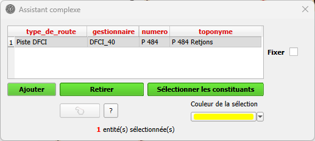
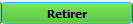
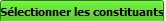
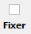
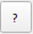
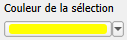
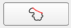
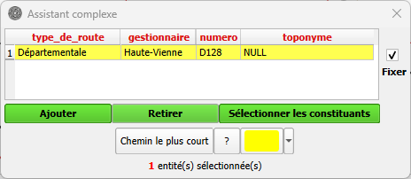
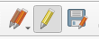
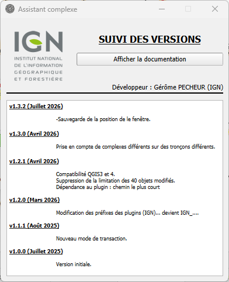

<table>
<colgroup>
<col style="width: 21%" />
<col style="width: 78%" />
</colgroup>
<tbody>
<tr>
<td rowspan="2"></td>
<td style="font-size: 24px;text-align: center;">
<strong>Manuel utilisateur du plugin
« Assistant complexe »</strong>

<strong>V1.3.2</strong>
</td>
</tr>
<tr>
<td style="font-size: 16px;text-align: center;">Développeur  : Gérôme PECHEUR (IGN)</td>
</tr>
</tbody>
</table>

## Sommaire

- [1. Prérequis](#prerequis)

- [2. Résumé](#resume)

- [3. Installation](#installation)

- [4. Présentation](#presentation)

- [5. Mode de sélection](#mode-de-sélection)

	- [5.1 Sélection unique](#selection-unique)

	- [5.2 Sélection multiple](#selection-multiple)

- [6. Modifications d’un complexe](#modifications-dun-complexe)

- [7. A propos de](#a-propos-de)

	

  <h2 id="prerequis" style="color: white;margin:0;" >1. Prérequis</h2>

- Version de QGIS : 3.28 ou supérieur

- Plugin « IGN Espace collaboratif » version 4.2.2 (minimum) auquel il
  fait accès pour modifier la BDTopo.

- Couche troncon_de_route  éditable de la BDTopo que l’on trouve dans
  les guichets en écriture directe BDTopo ‘sdis formation’, ‘sdis
  découverte’ et ‘sdis expert’.

- Package openpyxl (voir installation en annexe à la fin de ce
  document).

- Le plugin « PluginsManager » doit préalablement être installé : 
[PluginsManager-qgis-plugin sur GitHub](https://github.com/IGNF/maitre-qgis-plugin/releases/download/version_finale/PluginsManager.zip)

- Le fonctionnement de certaines fonctionnalités nécessite l’installation de :
[ShortestPath-qgis-plugin sur GitHub](https://github.com/IGNF/ShortestPath-qgis-plugin/releases/download/version_finale/IGN_ShortestPath.zip)  

  <h2 id="resume" style="color: white;margin:0;" >2. Résumé</h2>

Rappel des spécifications de la BDTopo :

Le numéro ou le nom des routes (départementales, autoroutes, nationales,
intercommunales, communales, chemins ruraux) est affiché dans les
tronçons de route (CPX_Numéro, CPX_Numéro de route européenne,
CPX_Toponyme route nommée) mais ces routes numérotées ou nommées sont
gérées par des objets Route numérotées ou nommées.

Le lien entre les tronçons de route et les routes numérotées ou nommées
est construit par l’attribut Liens vers route nommée des tronçons. C’est
la notion d’objets complexes.

Pour plus de précisions se référer aux [spécifications
BDTopo](https://geoservices.ign.fr/bd-topor-explorer-descriptif-de-contenu).

Ce plugin facilite la gestion de ce lien et permet d’ajouter, de retirer
un ou plusieurs tronçons de ces routes numérotées ou nommées et de
sélectionner tous les tronçons qui les composent.

  <h2 id="installation" style="color: white;margin:0;" >3. Installation</h2>

Ouvrir QGIS.

Allez dans Extensions/Installer/Gérer les extensions, cliquez sur
Installer depuis un ZIP, sélectionner le fichier ZIP puis cliquez sur
Installer le plugin.

  <h2 id="presentation" style="color: white;margin:0;" >4. Présentation</h2>

Cette interface permet de lire les informations des routes numérotées ou
nommées auquel appartiennent les tronçons de route sélectionnés mais
aussi de les retirer ou ajouter.

Le bouton  permet d’ajouter les tronçons
de route sélectionnés au complexe fixé dans la liste.

Le bouton  permet de retirer les
tronçons de route sélectionnés au complexe fixé dans la liste.

Le bouton  permet de sélectionner tous
les constituants (tronçons de route) du complexe choisi.

Le bouton à cliquer  sert à fixer le complexe
choisi afin de permettre la sélection de tronçons de route pour ajout ou
retrait du complexe.

Le bouton  permet d’afficher le suivi
des versions et permet également d’ouvrir la documentation du plugin

Le bouton  permet de modifier la
couleur de la sélection

Le bouton  permet de sélectionner tous
les tronçons compris entre 2 tronçons

  <h2 id="mode-de-sélection" style="color: white;margin:0;" >5. Mode de sélection</h2>

L’interface permet de modifier la couleur de la sélection des tronçons
dans QGIS, en fonction de la symbologie des tronçons il peut être
judicieux d’en modifier la couleur

  <h2 id="selection-unique" style="color: white;margin:0;" >5.1 Sélection unique</h2>

- Sélection unique, on ne sélectionne qu’un seul tronçon avec l’outil de
  sélection de QGIS

  <h2 id="selection-multiple" style="color: white;margin:0;" >5.2 Sélection multiple</h2>

- Sélection multiple avec l’outil de saisi. Dans QGIS on peut
  sélectionner manuellement un ensemble de tronçons

- Sélection multiple de tronçons contigües, on sélectionne
  2 tronçons visibles à l’écran et connectés
  par un réseau de tronçons. Ensuite en clique sur
  , le résultat est une
  sélection de tous les tronçons entre le premier et le deuxième
  sélectionnés respectant l’algorithme du chemin le plus court. Un
  contrôle visuel est toutefois nécessaire afin de vérifier si les
  tronçons sont bien ceux désirés.

  <h2 id="modifications-dun-complexe" style="color: white;margin:0;" >6. Modifications d’un complexe</h2>

- Lors de la sélection d’un tronçon de route, l’interface affiche la
  liste des complexes associés s’ils sont dans l’emprise du projet.

>  style="width:4.1841in;height:1.82153in" />

- On sélectionne le complexe à modifier. La case à cocher passe
  automatiquement à « cochée »

>  style="width:4.19042in;height:1.82428in" />

- Le complexe étant fixé on peut :

- Sélectionner les constituants avec : 

- Ajouter un ou plusieurs tronçon(s) au complexe avec :
  

- Retirer un ou plusieurs tronçon(s) au complexe avec :
  

- Les modifications faites avec l’outil ne seront
  effectives (objets modifiés sur le serveur) que lorsqu’on enregistrera
  les modifications par l’outil natif de QGis (disquette)
  

  <h2 id="a-propos-de" style="color: white;margin:0;" >7. A propos de</h2>

Accessible via .

Cette boite permet de suivre l’évolution des différentes versions ainsi
que d’afficher cette documentation.

